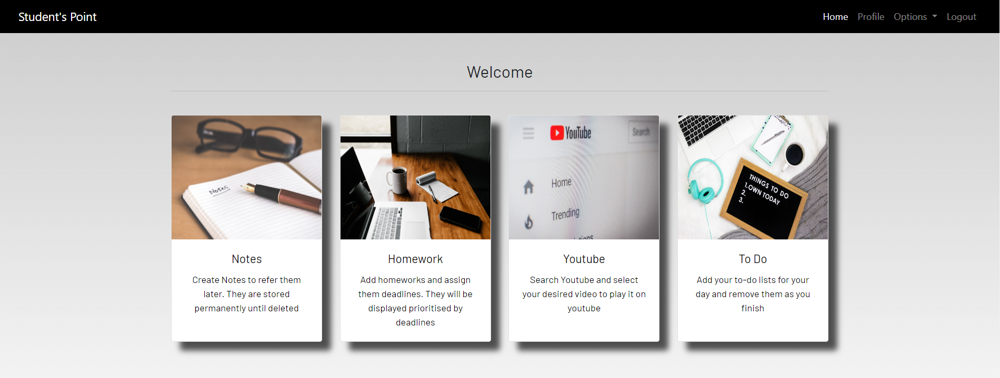
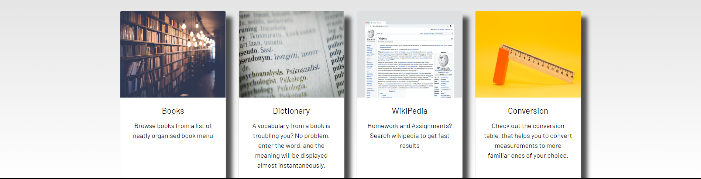

# Student's Point

## Table of Contents

* [Features](#features)
* [Installations](#installations)
* [Usage](#usage)
* [Contributing](#contributing)
* [License](#license)
* [Website Images](#websiteimages)

### Features

* User Authentication (Django built-in User Authentication)
* CRUD Operations (To-Do Feature, Adding Notes, Homeworks, etc.)
* Search Functionalities (YouTube Searching, Book Searching, Wikipedia Searching)
* Measurements (Heigh & Weight Calculator)

### Installations

1. Clone the repository:

   ```shell
   git clone <repository-url>
   cd Student-s-Point
   ```
2. Install the required Python packages:

   ```shell
   pip install -r requirements.txt
   ```
3. Configure the database settings in `studentstudyportal/settings.py`.
4. Apply migrations:

   ```shell
   python manage.py makemigrations
   python manage.py migrate
   ```
5. Create a superuser for admin access:

   ```shell
   python manage.py createsuperuser
   ```
6. Run the development server:

   ```shell
   python manage.py runserver
   ```
7. Username & Password:

   ```shell
   username: demo
   password: demosite
   ```

### Usage

#### Admin Access

1. Access the admin panel at `http://localhost:8000/admin/` and log in with the superuser credentials created in step 5 of the installation.
2. Use the admin panel can data in Notes, Homeworks, and also can view student's profie and many more.

#### User Access

* User can access all the functionalities like Note making, To-Do listing, Homework details, Search functionalities, and etc.

### Authentication

* The authentication process in this website is completely built using Django built-in Authentication Method and using Django Crispy Forms.

### Contributing

Contributions to this project are welcome. If you'd like to make improvements, please follow these steps:

1. Fork the repository.
2. Create a new branch for your feature or bug fix.
3. Make your changes and submit a pull request.

Please ensure your code follows best practices and includes appropriate tests.

### License

This project is licensed under the MIT License - see the [LICENSE](LICENSE) file for details.

### Website Images


